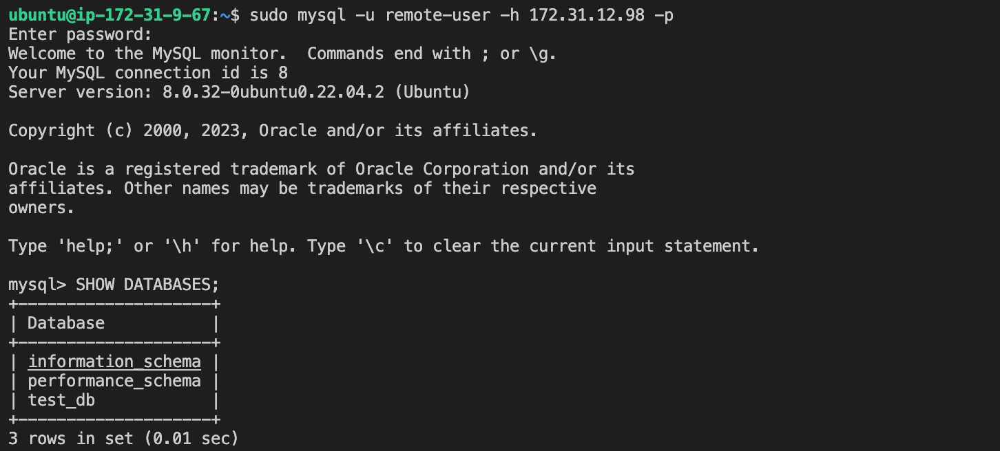

## CLIENT SERVER ARCHITECTURE USING MYSQL

Launch two Ubuntu instances on AWS 

## Installation of Mysql on the Server

`sudo apt update`

To install mysql

`sudo apt install mysq-server -y`

To enable mysql

`sudo systemctl enable mysql`

Run the securtiy script to prepare mysql server instance
`sudo mysql_secure_installation`

Fix error encountered - How to Fix: “Failed! Error: SET PASSWORD has no significance for user ‘root’@’localhost'”

```bash
https://devanswers.co/how-to-fix-failed-error-set-password-has-no-significance-for-user-rootlocalhost/?utm_content=cmp-true
```
Select yes to all sudo mysql_secure_installation questions

Create remote user - % means user can access from any ip address.

`CREATE USER 'remote-user'@'%' IDENTIFIED WITH mysql_native_password BY 'password';`

Create database

` CREATE DATABASE test_db;`

Grant privileges

`GRANT ALL ON test_db.* TO 'remote-user'@'%' WITH GRANT OPTION;`

`FLUSH PRIVILEGES;`

EXIT

CONFIGURE MYSQL SERVER TO ALLOW CONNECTION FROM REMOTE HOST

`sudo vi /etc/mysql/mysql.conf.d/mysqld.cnf`

Set the bind address to 0.0.0.0 so that users can connect from anywhere

Restart the service

`sudo systemctl restart mysql`

Run to see users and host

`Select user, host FROM mysql.user`


### Install mysql on the clientside


`sudo apt update`

To install mysql

`sudo apt install mysq-client -y`

To enable mysql

`sudo systemctl enable mysql`

Create new entry in inbound rule for TCP port 3306 on MYSQL server and allow only traffic from the client side by specifying the IP address.

Get private ip address
`ip addr show`

To log on as a user

`sudo mysql -u remote-user -h 172.31.12.98 -p`

Run command

`SHOW DATABASES;`

